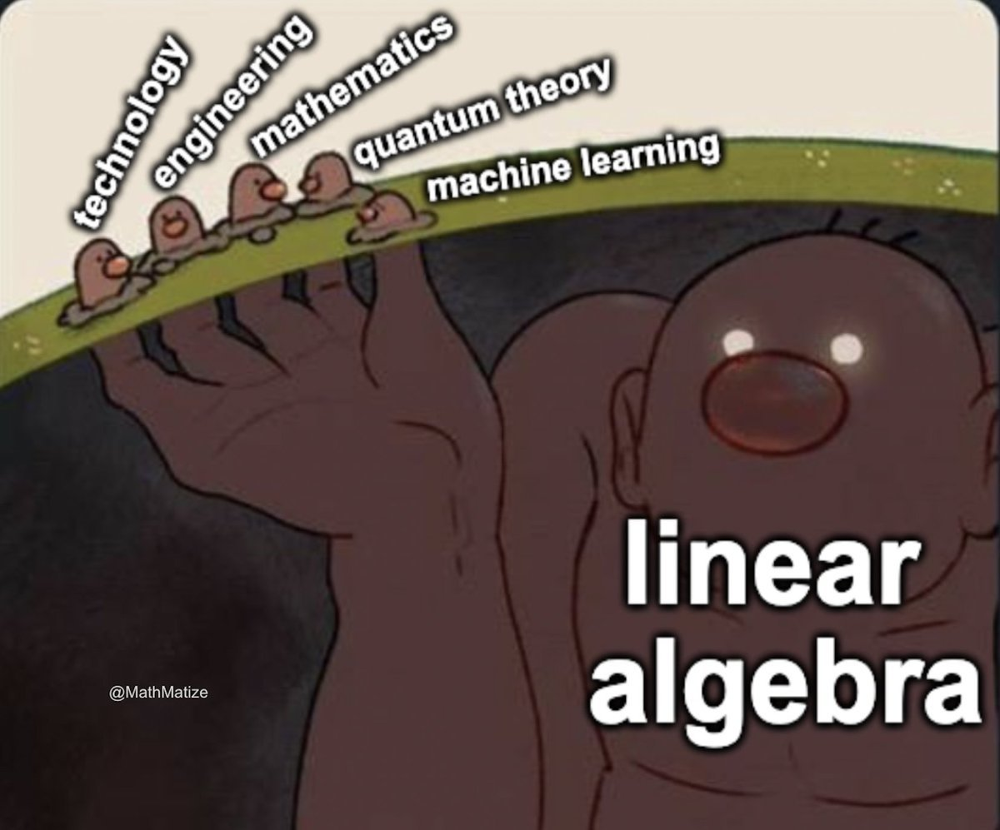

## ¿Sigues usando excel para todo? 🤨
Dicen por ahí que toda la inteligencia artificial y las tecnologías raras que existen te van a quitar el trabajo. Eso es mentira, no creo que la inteligencia artificial pueda salvar el semestre en una noche como lo hacemos nosotros (es broma 😅).

Lo que sí puede pasar es que personas con **habilidades en tecnología** te quiten ese puesto de trabajo tan anhelado. Hoy en día no es suficiente saber solo sobre tu profesión; debes ir un poco más allá.

Así como hace varios años se decía **“que sus hijos aprendan Excel e inglés, que lo demás viene por añadidura”**, hoy esa frase cambia por **“que sus hijos aprendan Python, IA e inglés, y el trabajo vendrá solo”**.

Aprovechemos entonces para aprender un poquito de Python (al menos para salir del desconocimiento) y, de paso, reforzamos Álgebra Lineal.


## ¿Hablar con computadoras?

Cuando hablas con tus amigos sobre, no sé, TikTok o cosas de jóvenes, te das cuenta de que ellos te entienden, ¿verdad? Puedes decirle algo a tu amigo y él (si le caes bien) lo hará.  
Nota que el proceso es algo así:

> **Conversación**
> - Estudiante: ¿Me puedes explicar de nuevo la última ecuación?
> - Profe Iván: Claro, mijo. *Procede a explicar.*

En este caso, tú le diste una **orden** al profe Iván. Como el profe Iván y tú hablan el mismo idioma, él fue capaz de entenderla y ejecutarla.  
Otra cosa muy distinta hubiera pasado si ustedes no se entienden mutuamente:

> **Conversación**
> - Estudiante: Profesor Iván, karo?gh yek’ indz bats’atrel verjin havasarumy?
> - Profe Iván: Mijo… ¿estás bien?

Nota que estás dando una orden en un lenguaje que tanto tú como el profesor entienden. Ahora, algo similar pasa con las computadoras: necesitas un lenguaje para indicarle al computador lo que quieres que haga.  
Claramente, este lenguaje no será español; no puedes hacer algo como:

> **Conversación (con el computador)**
> - Estudiante: Computador, por favor calcula el promedio de las notas del corte.
> - Computador: Bip bip… necesitas un 5.1 para el final. Bip bip.


## Lenguajes de programación

Claramente, no es tan fácil hablar con una computadora. Así como nosotros entendemos español, las computadoras solo entienden lenguajes formados por **unos y ceros** (como `1010111`). Seguramente has visto eso en alguna película, ¿verdad?… como *Matrix* 👀


Entonces, ¿cómo somos capaces de hablar con una computadora y darle órdenes?  
¿Acaso le hablamos directamente en unos y ceros? ¿Así es como se crean los TikToks? 😅  
**Antes sí era casi así**, pero hoy en día existe algo intermedio que nos facilita mucho la vida.

Estos son los llamados **lenguajes de programación**. Los lenguajes de programación nos permiten comunicarnos con la computadora de una manera más sencilla, usando un lenguaje que tanto nosotros como la computadora podemos entender.  
Es mediante estos lenguajes que se crean las aplicaciones que usamos hoy en día: WhatsApp, TikTok, hasta el navegador en el que estás leyendo esto está hecho con algún lenguaje de programación.


```python
print("hola, soy un código y hago cosas de código jeje")   
```
El código de arriba es un ejemplo de un programa muy simple en Python (el lenguaje de programación que usaremos)
Lo que hace es mostrar en pantalla el texto que está entre comillas. Aunque parece trivial, esta es la base de todo: darle instrucciones claras a la computadora para que ejecute una acción específica.